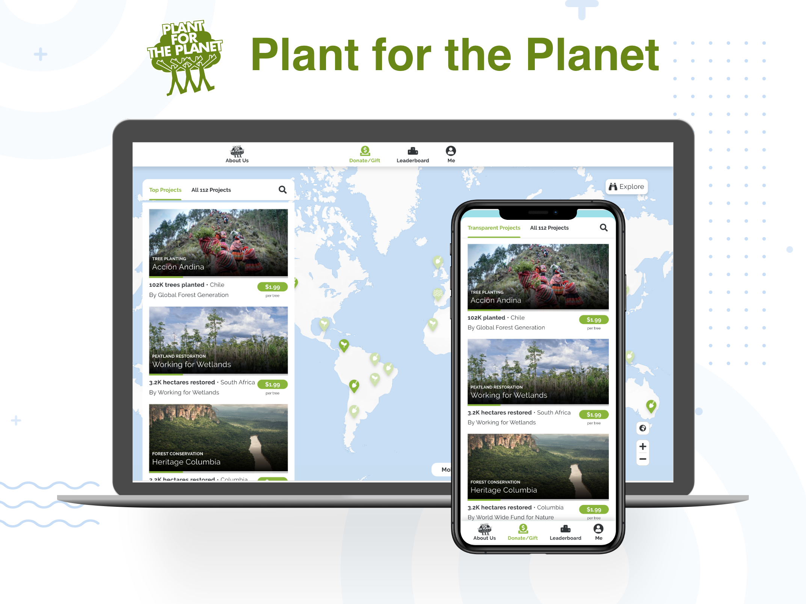

# Plant-for-the-Planet App

This repo contains web app of Plant-for-the-Planet.
For contributions please read our [contribution guide](./documentation/CONTRIBUTING.md) as well as our [code of conduct](./documentation/CODE_OF_CONDUCT.md)

This is a [Next.js](https://nextjs.org/) project bootstrapped with [`create-next-app`](https://github.com/vercel/next.js/tree/canary/packages/create-next-app).



---

## Directory Structure

<details><summary>pages - All the routes</summary>
<ul>
    <li>_app = Page initializations of the project</li></br>
    <li>_document = A custom Document is commonly used to augment your application's html and body tags.</li></br>
    <li>404 = Default 404 page if the route is not found</li></br>
    <li> Project pages -</li>
    </br>
    <table border="1">
        <tr>
            <td>#</td>
            <td><b>Page Name</b></td>
            <td><b>Route</b></td>
            <td><b>Functionality</b></td>
        </tr>
        <tr>
         <td>1</td>
            <td>index.tsx</td>
            <td>/</td>
            <td>Home page of the app with all the projects in list and map</td>
        </tr>
        <tr>
         <td>2</td>
            <td>[id].tsx</td>
            <td>/project-id</td>
            <td>Page of single project which loads all the details of the same</td>
        </tr>
        <tr>
         <td>3</td>
            <td>about.tsx</td>
            <td>/about</td>
            <td>About the organization</td>
        </tr>
        <tr>
         <td>4</td>
            <td>leaderboard.tsx</td>
            <td>/leaderboard</td>
            <td>Showcases the top donors from around the world</td>
        </tr>
        <tr>
         <td>5</td>
            <td>me.tsx</td>
            <td>/me</td>
            <td>User's private profile</td>
        </tr>
        <tr>
         <td>6</td>
            <td>tpo/[id].tsx</td>
            <td>/tpo/tpo-id</td>
            <td>TPO's profile</td>
        </tr>
        <tr>
         <td>7</td>
            <td>user/[id].tsx</td>
            <td>/user/user-id</td>
            <td>User's public profile</td>
        </tr>
    </table>
</ul>
</details>

<details><summary>public - Assets</summary>
<ul>
    <li>tenants = Assets of all the tenants</li>
    <li>And other public assets.</li>
</ul>
</details>

<details><summary>src - Source code</summary>
<ul>
    <li>assets = All the assets </li>
    <li>features = Project features are present here </li>
    <li>tenants = Tenant specific features are present here</li>
    <li>theme = Theme scss files </li>
    <li>utils = Utility functions</li>
</ul>
</details>

---

## Configuration

### Environment Setup

Rename `env.local.sample` to `env.sample` and add the necessary keys

---

## Development

### Run the development server

```bash
npm run dev
# or
yarn dev
```

Open [http://localhost:3000](http://localhost:3000) with your browser to see the result. The page auto-updates as you edit the file.

---

## Development Process

This project uses GitFlow (https://www.atlassian.com/git/tutorials/comparing-workflows/gitflow-workflow) with Master-Branch `master` and Development-Branch `develop`. The Master-Branch will be automatically released by Vercel bot to the production system. There are currently some more protected branches also build by Vercel bot automatically and mapped to test backends using the branch name as subdomain.

---

## Learn More

To learn more about Next.js, take a look at the following resources:

- [Next.js Documentation](https://nextjs.org/docs) - learn about Next.js features and API.
- [Learn Next.js](https://nextjs.org/learn) - an interactive Next.js tutorial.

You can check out [the Next.js GitHub repository](https://github.com/vercel/next.js/) - your feedback and contributions are welcome!

---

## Important Links

[Develop branch Deployment](https://planet-app-sf.herokuapp.com/)

[Designs & Prototype](https://xd.adobe.com/view/8f1c5110-4d7d-445d-8283-8eb1674ce2e4-da4f/)

[Backend APIs](https://stoplight.io/p/docs/gh/plant-for-the-planet-org/treecounter-platform?group=api-docs&utm_campaign=publish_dialog&utm_source=studio)

---

## Deploy on Vercel

The easiest way to deploy this Next.js app is to use the [Vercel Platform](https://vercel.com/import?utm_medium=default-template&filter=next.js&utm_source=create-next-app&utm_campaign=create-next-app-readme) from the creators of Next.js.

Check out our [Next.js deployment documentation](https://nextjs.org/docs/deployment) for more details.
